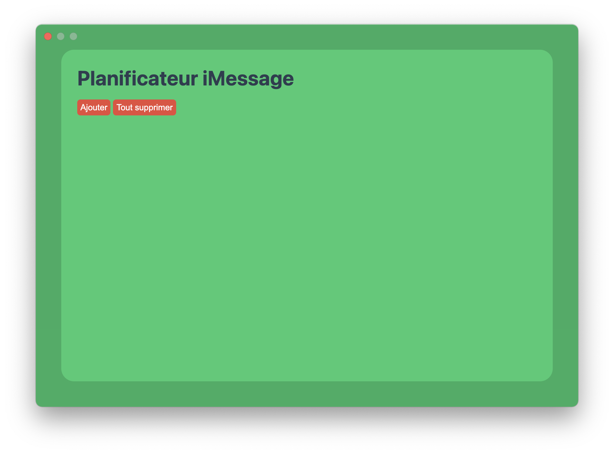
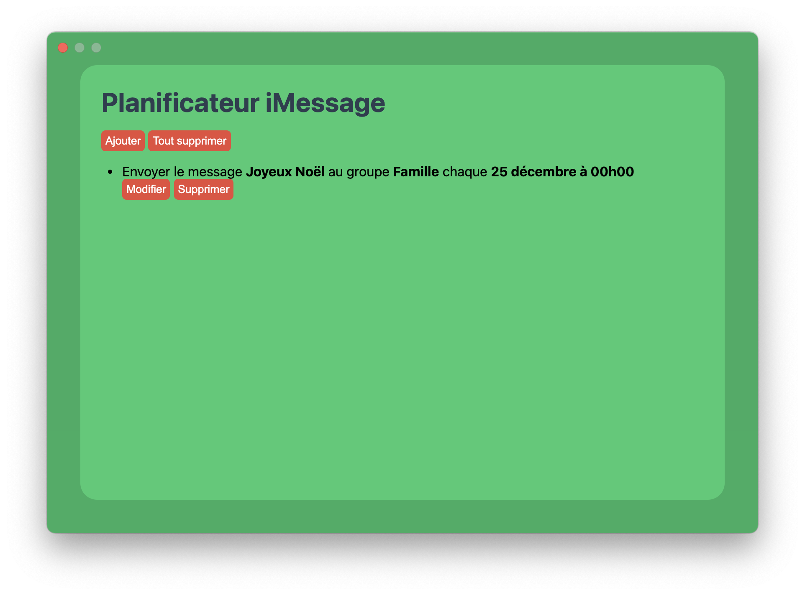
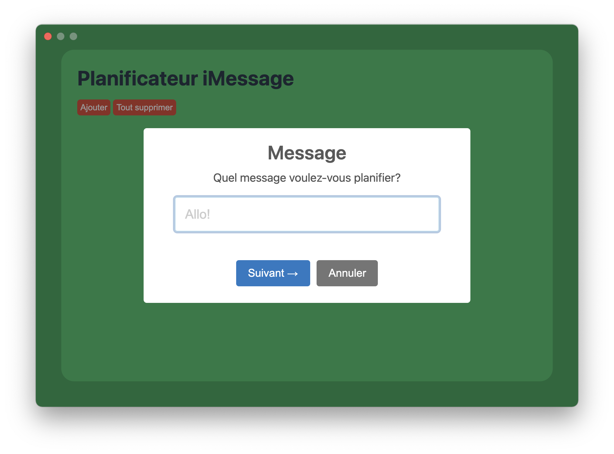

<div align="middle">
  </img>
  <h1>Planificateur iMessage</h1>
  <h3>Une application simple pour planifier l'envoi de messages texte</h3>
</div>

## Qu'est-ce que c'est?

**Planificateur iMessage** est une application simple pour planifier l'envoi de messages texte récurrents à chaque année. Le fonctionnement est simple: l'application va modifier la [Crontab](https://fr.wikipedia.org/wiki/Cron) de l'utilisateur qui utilise l'application pour y ajouter des commandes [AppleScript](https://fr.wikipedia.org/wiki/AppleScript) qui contrôlent l'application [iMessage](https://fr.wikipedia.org/wiki/IMessage). Il n'y a donc aucun processus qui roulant en arrière-plan.

**Example d'entrée CronTab générée**

```
0 0 25 12 * osascript -e 'tell application "Messages" to send "Joyeux Noël" to 1st participants whose full name is "Samuel Martineau"' #planificateur-imessage-75DB1E86-2DB8-44FE-904B-CBC11429E694-{"message":"Joyeux Noël","targetType":"buddy","target":"Samuel Martineau", "momentOfYear":{"minute":0,"hour":0,"day":"25","month":12},"uuid":"65c9ca5c-f146-4b22-a57a-28c2d7846034"}
```

## Captures d'écran





## Auteur

- [Samuel-Martineau](https://github.com/Samuel-Martineau)

## Crédits

- Apple (l'icône est simplement la combinaison de celle des applications _Messages_ et _Calendrier_)
