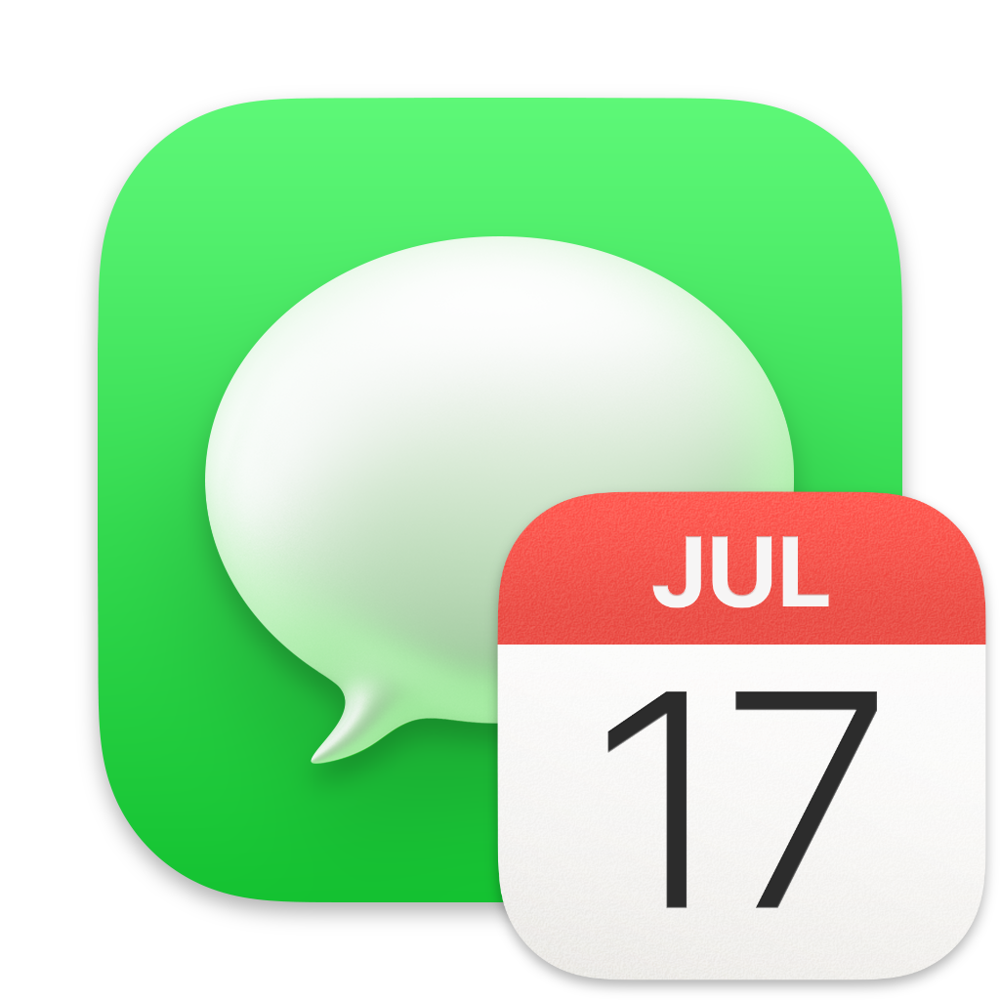

  </img>
  <h1>Planificateur iMessage</h1>
  <h3>Une application simple pour planifier l'envoi de messages texte</h3>

## Captures d'écran

## Auteur

- [Samuel-Martineau](https://github.com/Samuel-Martineau)

## Crédits

- Apple (l'icône est simplement la combinaison de celle des applications _Messages_ et _Calendrier_)
